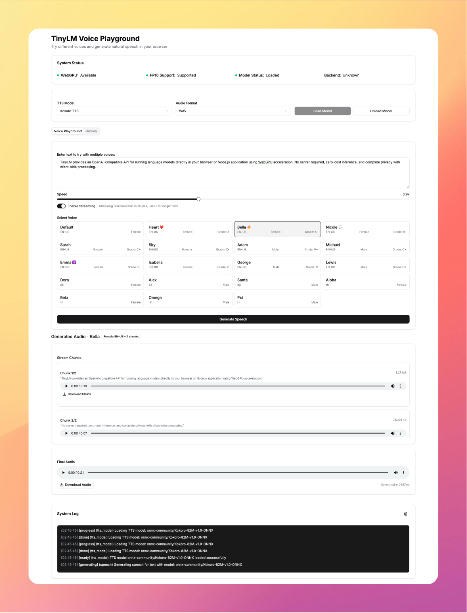

<div align="center">
  <h1> TinySonnet </h1>
  <p>
    <a href="https://github.com/wizenheimer/tinylm"><strong>Learn More »</strong></a>
  </p>
</div>



TinySonnet lets you experiment with KokoroTTS voice synthesis right inside your browser using WebGPU powered by TinyLM library.

## Features

- **Browser-based TTS**: Generate natural-sounding speech directly in your browser
- **No API Keys**: No external API services or subscriptions required
- **Streaming TTS**: Process longer texts in chunks with progressive audio generation
- **Multiple Voices**: Choose from various voices with different languages and genders
- **Adjustable Speed**: Control the speaking rate of generated speech
- **Audio Downloads**: Save generated audio in WAV or MP3 format
- **System Status**: Monitor WebGPU support and model loading progress
- **Persistent Interface**: UI remains responsive during generation

## Technical Stack

- **Next.js** with App Router and TypeScript
- **TinyLM** for browser-based TTS inference
- **KokoroTTS** for voice synthesis model
- **shadcn/ui** for components
- **WebGPU** (optional) for hardware acceleration

## Browser Requirements

- Modern browser with WebGPU support for optimal performance (Chrome 113+, Edge 113+, or other Chromium browsers)
- Falls back to WebGL when WebGPU is unavailable, but performance will be degraded
- Sufficient RAM (8GB+ recommended) for model loading

## Getting Started

### Installation

```bash
# Clone the repository
git clone https://github.com/wizenheimer/tinysonnet.git
cd tinysonnet

# Install dependencies
pnpm install
```

### Development

```bash
# Start the development server
pnpm dev
```

### Production Build

```bash
# Build for production
pnpm build

# Start the production server
pnpm start
```

## Usage Guide

### 1. Load the TTS Model

- The default model is "onnx-community/Kokoro-82M-v1.0-ONNX"
- Select your preferred audio format (WAV or MP3)
- Click "Load Model" and wait for the loading process to complete
- The status indicators will show you the model loading progress

### 2. Generate Speech

- Type your text in the playground input box
- Adjust the speed slider (default is 1.0x)
- Select a voice from the available options (different languages and genders)
- Toggle streaming mode on/off for processing longer texts
- Click "Generate Speech" and wait for the result
- Listen to the generated audio or download it for later use

### 3. View History

- Switch to the History tab to see your previously generated speech samples
- Listen to past generations without regenerating
- Compare results between different voices and settings

## Performance Notes

- First-time model loading requires downloading model weights (~82MB for Kokoro-82M)
- WebGPU acceleration provides significantly better performance
- Generation speed varies based on your device's capabilities
- Laptop/desktop with a discrete GPU recommended for best experience
- Mobile devices will have slower generation times

## Limitations

- Limited to models that fit in browser memory
- Generation speed is slower than server-based solutions
- Currently supports text-to-speech only
- No long-term storage beyond the current session

## Attribution

This project uses:

- [TinyLM](https://github.com/wizenheimer/tinylm) for browser-based ML inference
- [KokoroTTS](https://huggingface.co/onnx-community/Kokoro-82M-v1.0-ONNX) for text-to-speech synthesis
- [shadcn/ui](https://ui.shadcn.com/) for UI components
